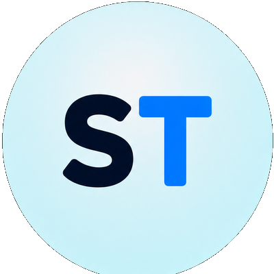
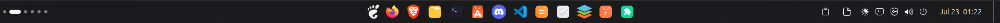
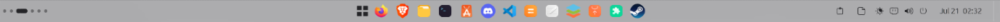
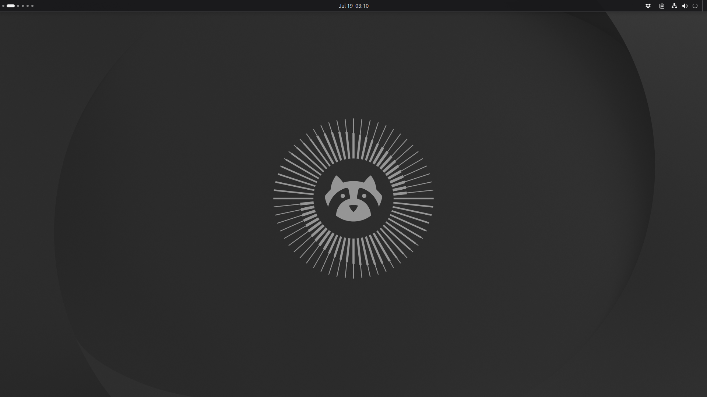
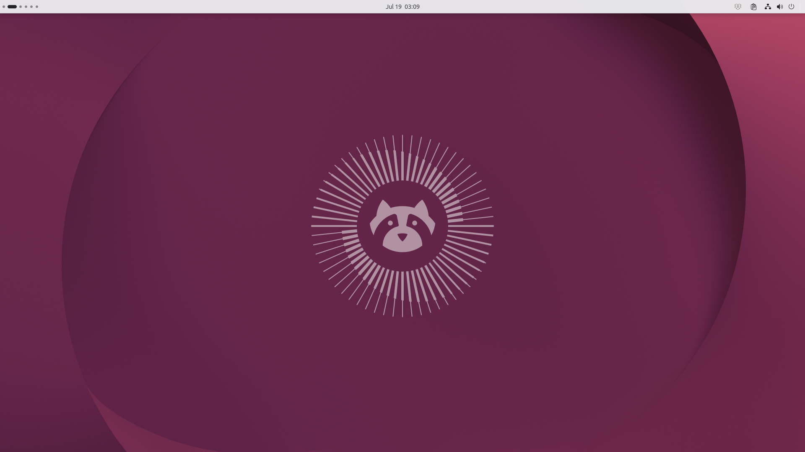
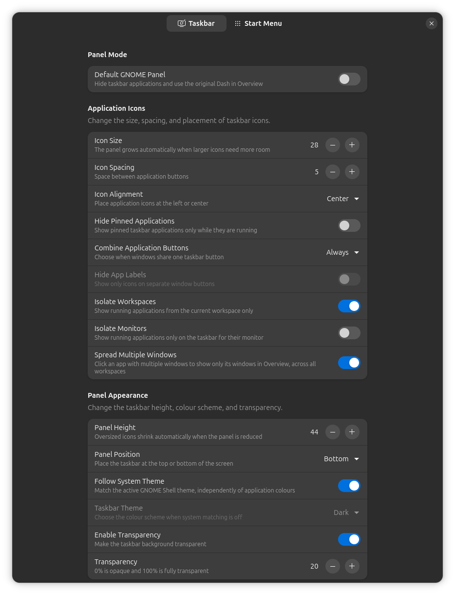
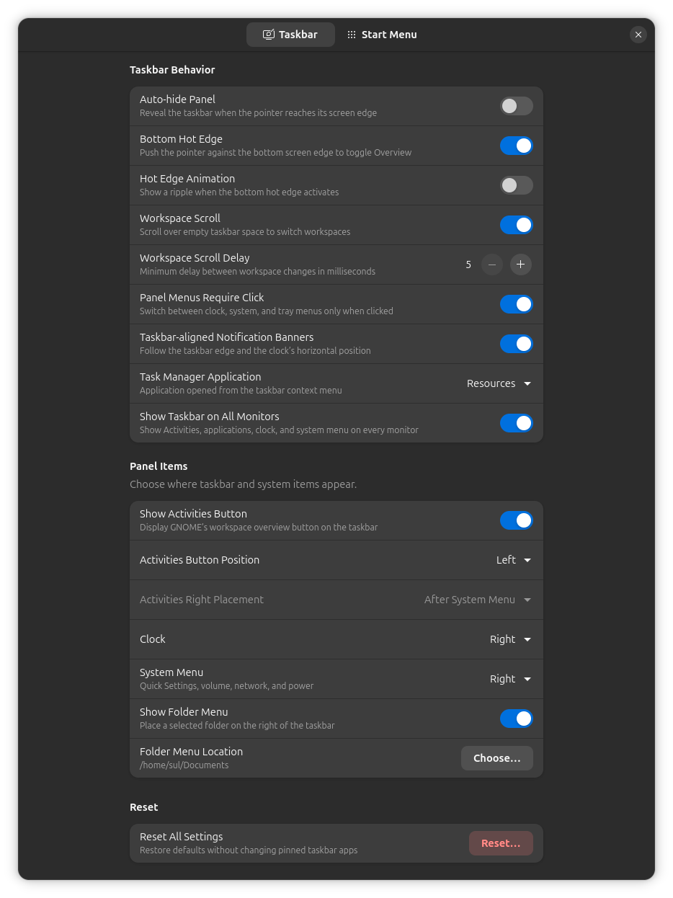
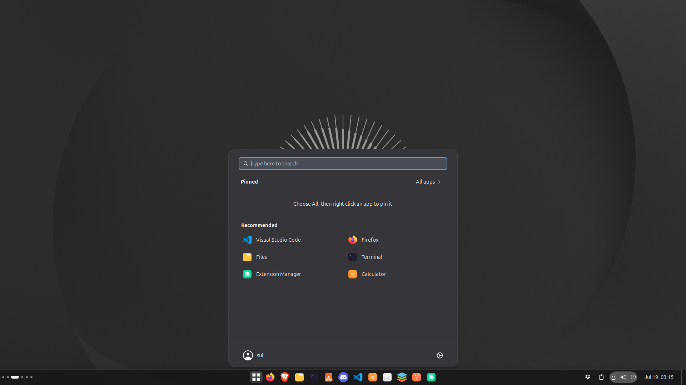
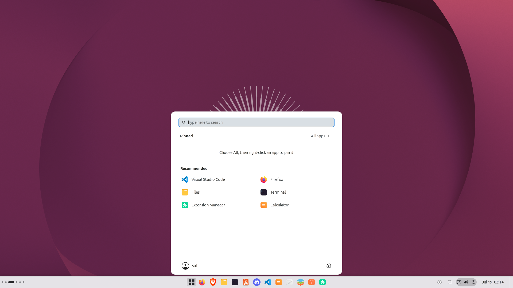
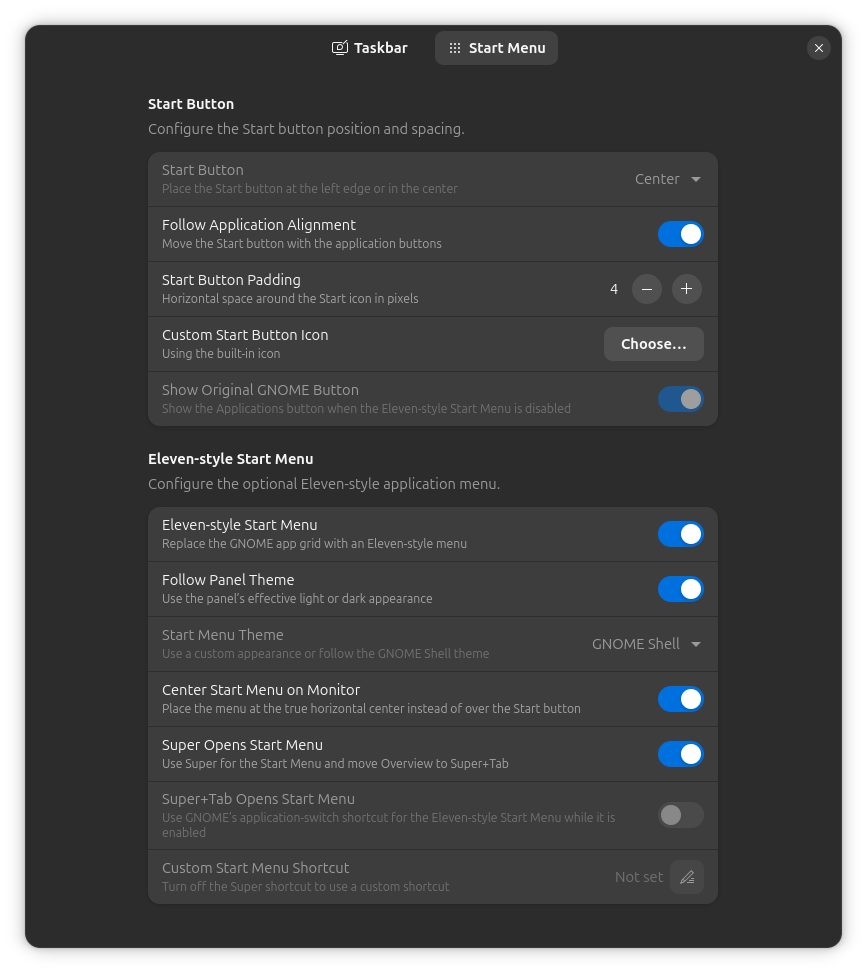

#  Simple Taskbar

Simple Taskbar turns GNOME Shell's native panel into a configurable desktop
taskbar. It combines pinned and running applications with GNOME's Activities,
clock, calendar, Quick Settings and extension indicators, without replacing
those Shell components.

> Simple Taskbar currently supports GNOME Shell 50.

## Preview

<p align="center">
  
  
</p>

<p align="center"><sub>Taskbar mode using the dark and light themes.</sub></p>

## At a glance

- See pinned and running applications together on the panel.
- Combine application windows always, only when the taskbar is full, or never; automatic mode shrinks optional labels from 140 px to 40 px before combining.
- Launch, focus, minimize and open new application windows from their icons.
- Preview open windows by hovering over an application.
- Use the taskbar on every monitor.
- Place the panel at the top or bottom of the screen.
- Align applications and the Start button to the left or center.
- Move the clock and Quick Settings between the left, center and right.
- Adjust panel height, icon size, spacing, transparency and colour scheme.
- Use auto-hide, workspace scrolling and current-workspace isolation.
- Open an Eleven-style Start Menu with pinned apps, search and recommendations.
- Switch to a native GNOME-style panel whenever taskbar applications are not
  wanted.

## Choose your panel style

| Mode | Behaviour |
| --- | --- |
| Taskbar | Shows GNOME favourites and running applications, starts on the desktop and hides the original Overview Dash. |
| Default GNOME Panel | Hides taskbar applications, restores the original Overview Dash and places a native-style panel on every monitor. |

Default GNOME Panel mode normally keeps GNOME's startup Overview. When Ubuntu
Dock or Dash to Dock is active, it starts on the desktop instead.

Both modes remain customizable after being enabled. Panel position, height,
theme, item placement, multi-monitor support and other appearance settings
continue to work.

<p align="center">
  
  
</p>

<p align="center"><sub>Default GNOME Panel mode using dark and light themes.</sub></p>

## Application taskbar

Simple Taskbar uses the same favourites and ordering as GNOME's original Dash.
Pinning, unpinning or rearranging a favourite updates the Dash as well.

Application buttons support:

- **Left click:** launch, focus or minimize the application.
- **Middle click:** open a new window.
- **Right click:** open GNOME's application menu.
- **Drag:** rearrange favourites or drag a running application into the
  favourite section to pin it.
- **Hover:** show live previews for open windows. A preview can activate or
  close its exact window.

Running, focused and multi-window applications have dedicated indicators.
Clicking an application with multiple windows can spread only that
application's windows across the Overview, including windows on other
workspaces. The preview flyout remains available as an alternative.

Optional controls can:

- Show running applications from only the current workspace.
- Hide favourite applications that are not running.
- Lock the taskbar against accidental rearrangement.
- Show the desktop from a narrow button at the panel edge.

## Panel customization

The settings provide control over:

- Top or bottom panel placement.
- Panels on secondary monitors.
- 32–80px panel height.
- 16–48px application icons with 0–16px spacing.
- Left or centered application alignment.
- Left or centered Start button placement, adjustable padding and a custom icon.
- Show or hide the Activities button independently.
- Left, center or right placement for the clock and Quick Settings.
- Light, dark or Shell-following themes.
- Adjustable transparency and Blur My Shell integration on the primary panel.
- Animated auto-hide on every panel.
- Workspace switching by scrolling over empty panel space.
- Notification banners that follow the panel edge and clock alignment.
- Click-only switching between open panel menus.
- A configurable Task Manager entry in the empty-panel context menu.

**Theme note:** **Follow system theme** follows the GNOME Shell theme rather
than the application colour preference alone. It switches to the light taskbar
only when GNOME Shell itself uses a light theme after dark mode is disabled in
Control Center. Ubuntu supports this through its light Yaru Shell theme. Stock
GNOME installations, including Fedora's default configuration, keep the Shell
dark when applications use light mode; select **Light** manually in the
extension settings to use a light taskbar in that situation.

<p align="center">
  
</p>

<p align="center"><sub>Application icon, panel mode and appearance controls.</sub></p>

<p align="center">
  
</p>

<p align="center"><sub>Behaviour, panel item and reset controls.</sub></p>

### Optional folder menu

Add a folder button to the panel for quickly opening files from a selected
directory with their default applications.

<p align="center">
  
</p>

<p align="center"><sub>Open files quickly from the optional custom folder menu.</sub></p>

## Eleven-style Start Menu

The Eleven-style Start Menu is enabled by default and includes:

- A separately configurable pinned-app grid.
- Application search.
- An All Apps view.
- Recommended applications.
- Application context menus with Pin to Start and Pin to Taskbar actions.
- Dark, light and GNOME Shell theme options.
- Optional true monitor centering.
- Optional Super+Tab or custom keyboard shortcuts.

The original GNOME Applications button can be restored instead. Right-clicking
the Eleven-style Start button opens its settings page.

<p align="center">
  
  
</p>

<p align="center"><sub>The Eleven-style Start Menu using dark and light themes.</sub></p>

<p align="center">
  
</p>

<p align="center"><sub>Start button and Eleven-style Start Menu controls.</sub></p>

## Install

Once Simple Taskbar is published on GNOME Extensions, it can be installed from
the website or Extension Manager.

To install the current source version:

```sh
git clone https://github.com/Sultech/simple-taskbar.git
cd simple-taskbar
./package.sh
gnome-extensions install --force \
    dist/simple-taskbar@sultech.shell-extension.zip
gnome-extensions enable simple-taskbar@sultech
```

Log out and back in if the running Shell does not discover a newly installed
extension immediately.

## Open the settings

Use Extension Manager, right-click empty taskbar space and choose **Taskbar
Settings**, or run:

```sh
gnome-extensions prefs simple-taskbar@sultech
```

**Reset All Settings** restores the extension defaults without changing GNOME's
taskbar favourites or their order.

## Compatibility

Simple Taskbar supports GNOME Shell 50. Other GNOME versions are deliberately
not declared until they have been tested.

Because Simple Taskbar and Dash to Panel both restructure GNOME's main panel,
Dash to Panel remains disabled while Simple Taskbar is active. Dash to Dock and
Ubuntu Dock are disabled only while Taskbar mode is active so that two docks do
not compete for the same screen edge. Both docks remain available in Default
GNOME Panel mode.

Blur My Shell styles are supported on the primary panel. Secondary panels use
Simple Taskbar's own background and transparency.

## Development

GNOME Shell caches imported extension modules for the lifetime of the Shell
process. Disabling and re-enabling an extension cannot load edited JavaScript
into that same process.

On Ubuntu, install Mutter's development helper:

```sh
sudo apt install mutter-dev-bin
```

Then run:

```sh
./dev.sh
```

The helper compiles the GSettings schema, creates this development symlink and
starts a fresh GNOME Shell 50 session in a window:

```text
~/.local/share/gnome-shell/extensions/simple-taskbar@sultech
    -> /path/to/simple-taskbar
```

Close the nested Shell and run `./dev.sh` again after changing JavaScript. The
real desktop session remains running.

If a copied installation already occupies the destination, disable it and move
or remove that directory before running the helper. Backup extension
directories should not be kept under
`~/.local/share/gnome-shell/extensions`, because GNOME Shell still scans
them.

Use Looking Glass or the journal when diagnosing runtime problems:

```sh
journalctl -f -o cat /usr/bin/gnome-shell
```

## Build a package

Create the complete installable archive with:

```sh
./package.sh
```

The resulting archive is:

```text
dist/simple-taskbar@sultech.shell-extension.zip
```

The package contains the runtime modules, preferences, schema, licence and
bundled Start icon. Development scripts and generated schema binaries are not
included. An alternative output directory can be supplied:

```sh
./package.sh /tmp/simple-taskbar-package
```

## Privacy

Simple Taskbar does not collect telemetry, access the network or run bundled
external programs.

## Uninstall

```sh
gnome-extensions disable simple-taskbar@sultech
rm -rf ~/.local/share/gnome-shell/extensions/simple-taskbar@sultech
```

## Licence

Simple Taskbar is distributed under
[GPL-2.0-or-later](COPYING).
