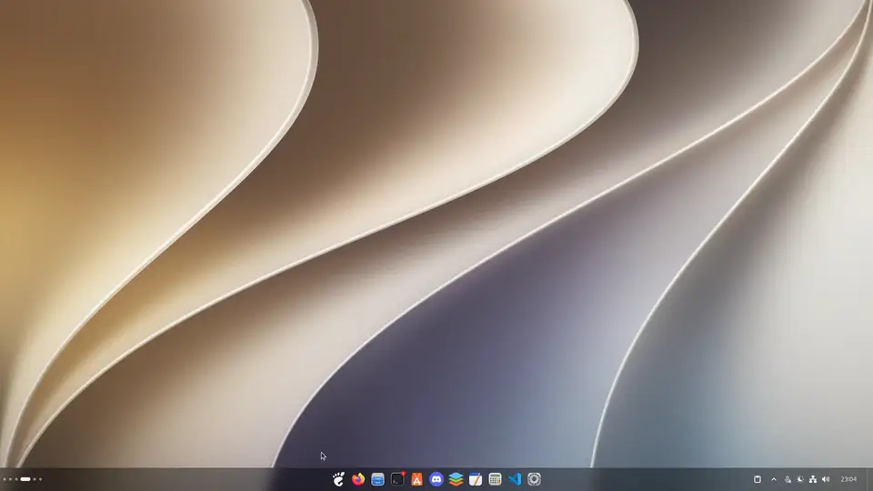
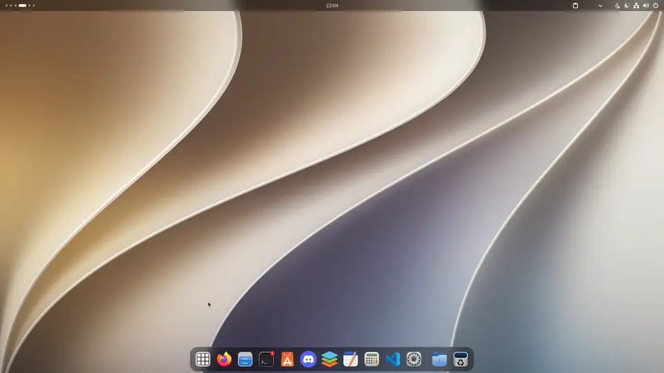
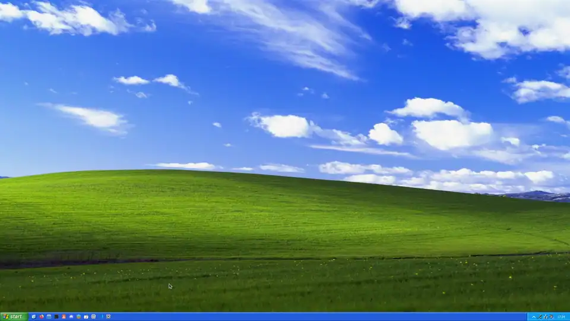
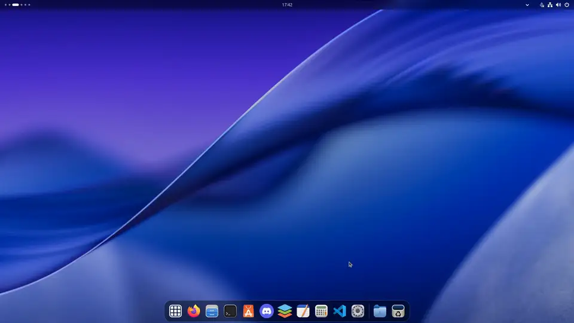
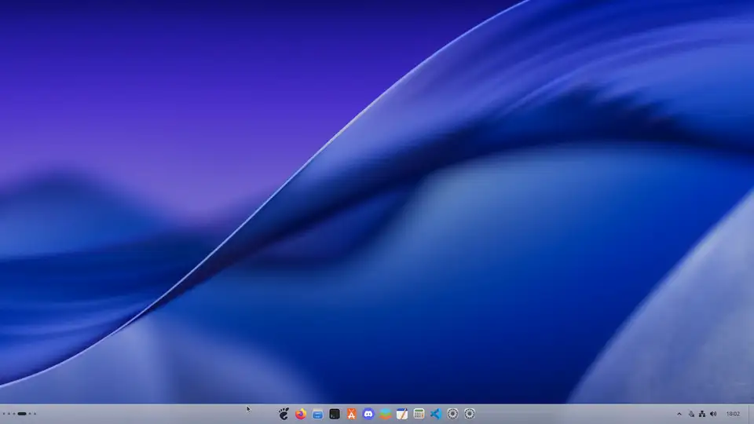
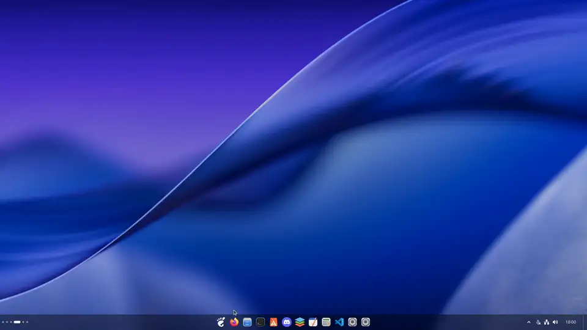
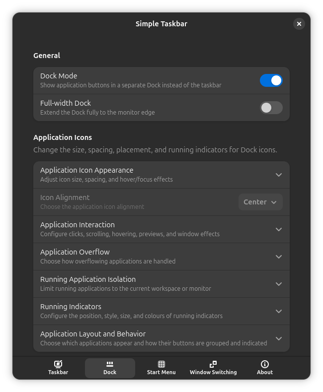

#  Simple Taskbar

  
  

Simple Taskbar turns GNOME Shell's native panel into a configurable desktop
taskbar and can provide a separate application Dock. It keeps GNOME's
Activities, clock, calendar, Quick Settings and extension indicators while
adding pinned applications, running applications, window previews and an
optional Eleven-style Start Menu.

> Simple Taskbar supports GNOME Shell 48, 49, 50 and 51 only.

## Gallery

  
  
Taskbar, Windows XP Theme and Dock modes.

<table>
  <tr>
    <td align="center" width="50%">
      
        <b>Taskbar Mode</b>
    </td>
    <td align="center" width="50%">
      
        <b>Dock with Icon Magnification</b>
    </td>
  </tr>
  <tr>
    <td align="center" width="50%">
      
        <b>Windows XP Theme</b>
    </td>
    <td align="center" width="50%">
      
        <b>Hover Animations and Settings</b>
    </td>
  </tr>
  <tr>
    <td align="center" width="50%">
      
        <b>Start Menu in the Light Theme</b>
    </td>
    <td align="center" width="50%">
      
        <b>Start Menu in the Dark Theme</b>
    </td>
  </tr>
</table>

## Panel Styles

| Style | What it does |
| --- | --- |
| **Taskbar** | GNOME favourites and running applications on the panel. Starts on the desktop and hides GNOME's Overview Dash. |
| **Dock** | Applications in a separate Dock, leaving the main panel free for GNOME and extension items. |
| **Windows XP Theme** | A Windows XP-inspired look: 30px panel, 16px icons, fixed spacing, XP artwork and a classic taskbar layout. |
| **Default GNOME Panel** | Hides taskbar applications and Start buttons, restores GNOME's Dash in Overview, keeps the panel options. |

Windows XP Theme applies its own dimensions and layout. Conflicting controls are
disabled while it is active, and your previous mode and settings are restored
when you turn it off. Default GNOME Panel mode keeps panel position, height,
themes, item order and multi-monitor settings available, and normally keeps
GNOME's startup Overview — Dash to Dock and Ubuntu Dock can change that.

## Features

Simple Taskbar follows GNOME's application favourites and their order, so
pinning anywhere updates the taskbar, the Dock and GNOME's own Dash together.

### Applications

- **Click actions** — choose from *Cycle Windows + Minimize*, *Cycle Through Windows*,
  *Toggle Single / Preview Multiple*, *Toggle Single / Cycle Multiple*, *Spread Multiple
  Windows*, *Toggle Windows*, *Raise Windows* and *Launch New Instance*
- **Modifier clicks** — Shift+click, middle-click and Shift+middle-click each take their own action, including *Quit* and *Minimize Window*
- **Hover action** — show window previews, show a tooltip, or do nothing
- **Window previews** with separate show and hide delays, and optional middle-click to close the window
- **Window peeking** brings the hovered window to the front temporarily, with its own delay and an adjustable opacity for the other windows
- **Spread windows** — one click spreads just that application's windows in Overview, including windows on other workspaces
- **Scroll over an icon** to switch workspace or cycle that application's windows, with an adjustable delay
- **Drag to reorder** pinned applications and move running groups
- **Grouping** — *Always* (one icon per application), *Only When Full* (split until space runs out) or *Never* (one per window)
- **Window titles** beside split icons, with adjustable font size, weight, maximum width and an optional fixed width, or hidden entirely
- **Notification badges** showing unread counts on application icons
- **Overflow** — a *Taskbar Flyout* or *Application List* popup for what does not fit. Dragging works across visible and overflow entries, and the popup stays open while dragging
- **Scrolling taskbar** when overflow is off, moving through applications instead of switching workspaces
- **Pinned launchers** — keep favourites as launchers and show their windows separately
- **Visibility** — hide pinned applications, hide unpinned ones, or hide pinned applications on secondary monitors only
- **Isolation** by current workspace or by the monitor the taskbar is on
- **Separators** between pinned and running applications, and between applications and locations

### Icons and Effects

- **Icon size** 15–63px, **spacing** 0–16px, and a **minimum size** for when space runs short
- **Alignment** — left or centre on horizontal panels, top or middle on vertical panels
- **Hover animation** — *Simple*, *Ripple* or *Magnify*, each with a tunable profile: duration, dock expansion, rotation, travel, zoom, curve convexity and how many neighbouring icons react
- **23 click animations** — Bounce, Jump, Heartbeat, Squish, Jelly, Spin, 3D Spin,
  Horizontal Flip, Roll, Zoom Out & Fade, Squeeze, Glow, Dim, Tada, Swing, Shake, Nudge
  Up/Down/Left/Right, Pulse Larger, Pulse Smaller and GNOME Launch Zoom
- **Hover and focus effect** — *Glass*, or *Classic* with its own hover and pressed
  colours, highlight border radius, focused-application highlight, opacity, and an
  option to take the colour from the icon itself
- **Window minimize effect** — GNOME's default or **Magic Lamp**
- **Running indicators** — rounded or straight, placed on any edge of the icon, with
  adjustable size, optional full length, custom focused and unfocused colours, or
  **Match Icon Color** taken from the application's own icon

### Panel Appearance

- **Thickness** 32–80px and **position** on the top, bottom, left or right edge
- **Themes** — light, dark, or follow GNOME Shell
- **Custom colours**, gradients, gradient direction, and light or dark panel text
- **Transparency** and separate borders per light and dark theme
- **Blur My Shell** translucency and blur on primary and secondary panels, with Simple Taskbar's own background as the fallback on secondary panels

### Behaviour

- **Auto-hide** with animation on every panel, revealed at the screen edge
- **Dodge windows** — hide for all windows, the focused application's windows, only the focused window, or only maximized windows, with an optional pointer reveal
- **Hot edge** at the bottom that toggles Overview, with adjustable activation pressure and an optional ripple
- **Scroll over empty space** to switch workspace, cycle windows or change volume, with an adjustable delay
- **Application volume mixer** in Quick Settings for individual streams
- **Tray icons** gathered behind a panel arrow, positioned where you want it
- **Task Manager** entry in the panel menu — Resources by default, with automatic fallback to GNOME System Monitor or Mission Center
- **Multi-monitor** — show the taskbar on every connected monitor
- **Click-to-open menus** instead of switching panel menus on hover
- **Notification banners** aligned to the panel edge and clock position
- **Lock the taskbar** against accidental rearrangement

### Panel Items

Three item groups — **Left**, **Center** and **Right** on horizontal panels, or
**Top**, **Middle** and **Bottom** on vertical ones — hold the Start and
Activities buttons, Applications, Folder Menu, the tray icon arrow, Quick
Settings, Clock and Show Desktop.

- **Item ordering** with Move Up and Move Down inside each group, around a fixed box row for other GNOME Shell and extension items
- **Button padding** — Automatic follows Just Perfection when present and 3px otherwise,
  while an explicit 0–20px value takes precedence. Default GNOME Panel mode uses 12px
  and restores Automatic on return
- **Folder Menu** opens files from a chosen directory with their default applications
- **Show Desktop** minimises or restores every window, with adjustable width and an optional custom separator colour
- **Reset All Settings** restores defaults without touching taskbar favourites or Start Menu pins

### Locations

- Common folders, Trash, and connected drives and volumes, in the taskbar and the Dock independently
- Drive entries can be limited to mounted drives, or include network volumes
- Home, Desktop, Documents, Downloads, Music, Pictures and Videos shortcuts in the Nautilus application menu

### Dock

Dock mode moves applications out of the panel into a separate Dock, with its own
copy of the icon, effect, indicator, overflow and isolation settings.

- Placement on any edge, independent of the taskbar's own position
- **Maximum length** as a percentage of the monitor, or a full-width Dock reaching the edges
- **Corner radius**, independent themes, transparency, gradients, text colour, borders and Blur My Shell
- **Auto-hide** with the same window-dodge modes, plus edge reveal and an option to limit reveal to the Dock's own edge
- **Scroll** over empty Dock space to switch workspace, cycle windows or change volume
- Shown on every connected monitor, with its own item order and locations

### Start Menu

The Eleven-style Start Menu is enabled by default.

- **Pinned grid** with drag-and-drop ordering, folders, and optional titles under icons
- **Global search** through GNOME, including compatible system and extension providers
- **All Apps** view with selectable categories or one alphabetical list, and the option to open there by default
- **Application menus** — open windows, launcher actions, App Details, Quit, Pin to Start, Pin to Taskbar or Dock, and desktop shortcuts when a supported desktop-icons extension is active
- **Drag from All Apps** onto the taskbar or Dock to pin
- **Recommended applications**, which can exclude what is already pinned
- **Running indicators** under applications that are open
- **Folder shortcuts** beside the Settings icon, plus the account profile picture and a footer power menu
- **Keyboard navigation** with Tab and the arrow keys, and delayed tooltips carrying names and descriptions
- **Themes** — dark, light or follow GNOME Shell, with panel-matched transparency and optional monitor-centred positioning

The Start button can be the Eleven-style button or GNOME's original
Applications button. It follows application alignment or takes a manual
position, with custom padding, an optional separator and a bundled or personal
icon; either button can be hidden, and right-clicking the Eleven-style button
opens its settings. Its context menu can offer Installed Apps, Event Viewer,
System, Network Connections, Disk Management, Terminal, Task Manager, File
Explorer, Run and Desktop.

### Window Switching

Grid Alt-Tab replaces the application switcher with a responsive grid of live
window previews, keeping normal Alt+Tab and Shift+Alt+Tab selection. It is
enabled by default, supports pointer and arrow-key navigation, and activates
the selected window when Alt is released.

- Maximum preview card size
- All workspaces or only the current one
- All monitors or only the monitor showing the switcher
- Popup on the current monitor or always the primary

### Keyboard Shortcuts

| Shortcut | Action |
| --- | --- |
| **Super** | Opens the Start Menu, moving Overview to **Super+Tab** |
| **Super+Tab** | Opens the Start Menu instead, when the Super shortcut is off |
| **Super+E** | Opens the home folder in the default file manager |
| **Super+1** … **Super+9** | Activates that pinned application; pressing it again on the focused one minimises it |

A custom shortcut can open the Start Menu when both built-in shortcuts are off.
Each shortcut can be disabled, conflicts between the extension's own shortcuts
are checked, and GNOME's saved shortcuts are never changed. The previous Mutter
overlay-key setting is restored when the extension is disabled.

### Profiles

Export and import profiles containing panel settings, Dock settings and Start
Menu pins from the About page.

## Settings

<table>
  <tr>
    <td align="center" width="50%">
      
        <b>Taskbar</b>
    </td>
    <td align="center" width="50%">
      
        <b>Dock</b>
    </td>
  </tr>
  <tr>
    <td align="center" width="50%">
      
        <b>Start Menu</b>
    </td>
    <td align="center" width="50%">
      
        <b>Window Switching</b>
    </td>
  </tr>
</table>

Most detailed controls sit in expandable rows on each page. Open the settings
with Extension Manager, by right-clicking empty taskbar, panel or Dock space
and choosing the settings item, or by running:

    gnome-extensions prefs simple-taskbar@sultech

## Installation

Install Simple Taskbar from
[GNOME Extensions](https://extensions.gnome.org/extension/10448/simple-taskbar/)
or Extension Manager.

To install the current source version:

    git clone https://github.com/Sultech/simple-taskbar.git
    cd simple-taskbar
    ./package.sh
    gnome-extensions install --force dist/simple-taskbar@sultech.shell-extension.zip
    gnome-extensions enable simple-taskbar@sultech

Log out and back in if GNOME Shell does not discover a newly installed
extension immediately.

## Compatibility

Simple Taskbar supports GNOME Shell 48, 49, 50 and 51. Other GNOME versions
are not declared until they have been tested.

Dash to Panel is disabled while Simple Taskbar is active because both
extensions restructure GNOME's main panel. Dash to Dock and Ubuntu Dock are
disabled whenever Taskbar, Dock or Windows XP Theme mode is active; both remain
available in Default GNOME Panel mode.

Blur My Shell panel styling is supported on the primary and secondary panels.
When a supported desktop-icons extension is active, Start Menu application
menus can also add or remove desktop shortcuts.

## Development

GNOME Shell caches imported extension modules for the lifetime of the Shell
process. Disable and re-enable is not enough to load edited JavaScript into the
same process.

On Ubuntu, install:

    sudo apt install mutter-dev-bin gettext

Then run:

    ./dev.sh

The helper compiles the schema, creates a development symlink under
<code>~/.local/share/gnome-shell/extensions/</code> and starts a fresh GNOME
Shell 50 development session in a window. Close that window and run
<code>./dev.sh</code> again after changing JavaScript. The real desktop session
remains running.

If a copied installation already occupies the destination, disable the
extension and move or remove that directory before running the helper. Do not
keep backup extension directories under
<code>~/.local/share/gnome-shell/extensions</code>, because GNOME Shell still
scans them.

For runtime problems, use Looking Glass or the journal:

    journalctl -f -o cat /usr/bin/gnome-shell

## Build a package

Building requires <code>msgfmt</code> from GNU gettext,
<code>glib-compile-schemas</code> and <code>gnome-extensions</code>:

    ./package.sh

The package is written to:

    dist/simple-taskbar@sultech.shell-extension.zip

An alternative output directory can be supplied:

    ./package.sh /tmp/simple-taskbar-package

The archive contains the runtime modules, preferences, schema, licence,
bundled artwork, attribution notices and compiled translations. Development
scripts, translation sources and generated schema binaries are left out.

## Privacy

Simple Taskbar does not collect telemetry, access the network or run bundled
external programs. GNOME's global search providers remain responsible for
their own results. Some providers can ask Simple Taskbar to copy result text
to the clipboard when that result is activated.

## Uninstall

    gnome-extensions disable simple-taskbar@sultech
    rm -rf ~/.local/share/gnome-shell/extensions/simple-taskbar@sultech

## Licence

Simple Taskbar is distributed under
[GPL-2.0-or-later](COPYING). Bundled third-party icon credits and trademark
notices are listed in [ASSET-CREDITS.md](ASSET-CREDITS.md).
