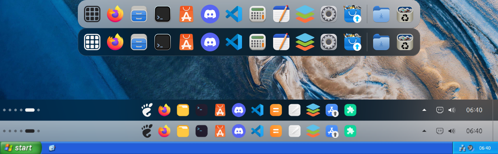
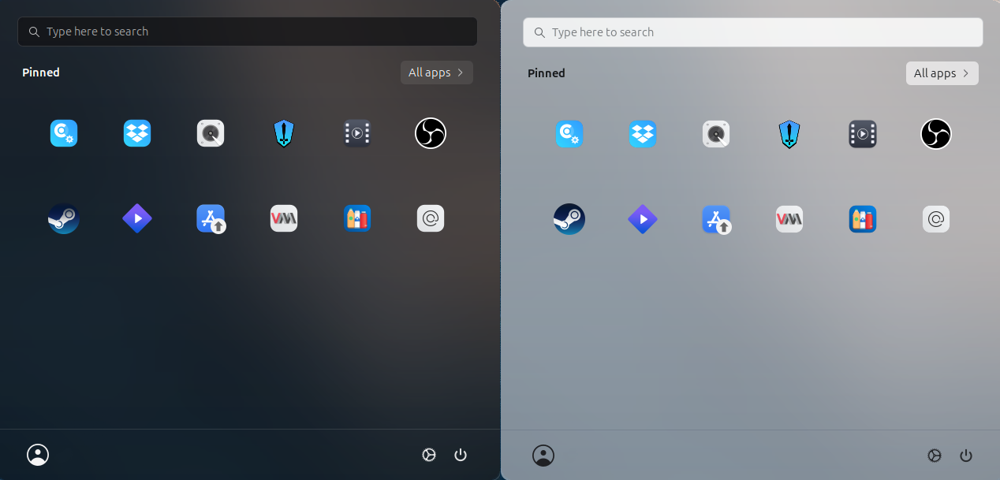
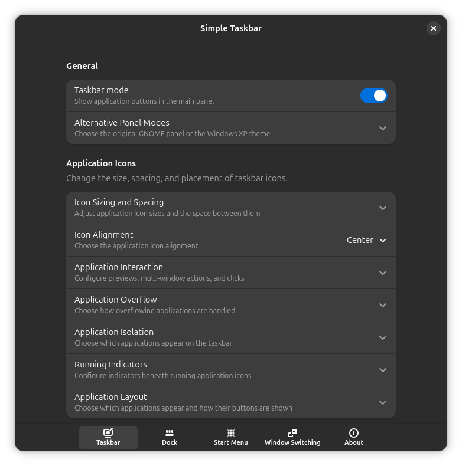
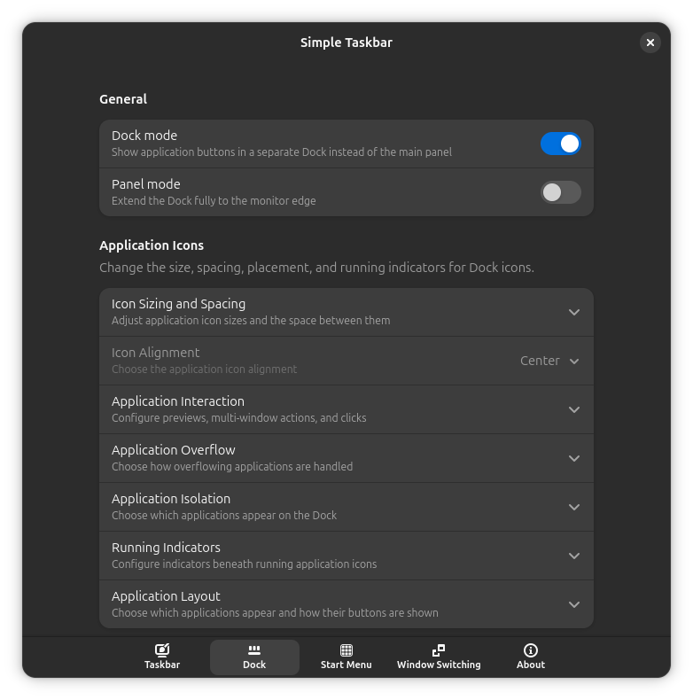
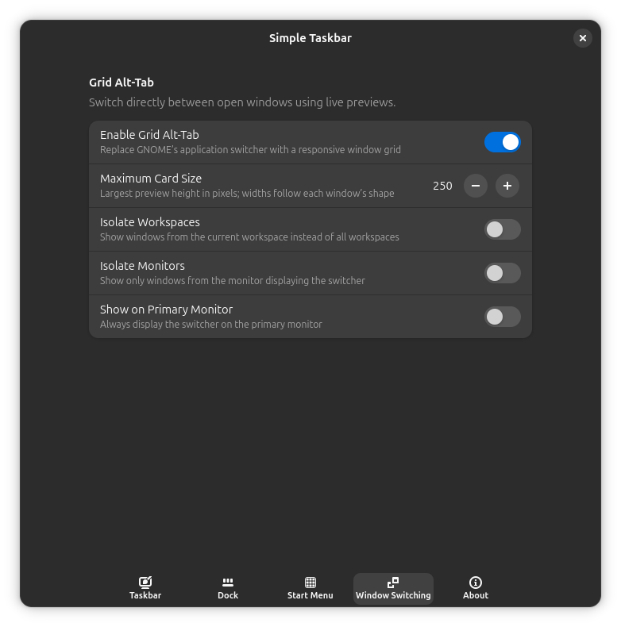
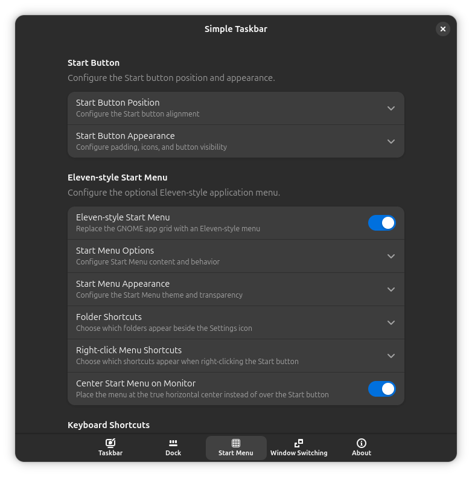

#  Simple Taskbar

  
  

Simple Taskbar turns GNOME Shell's native panel into a configurable desktop
taskbar and can provide a separate application Dock. It keeps GNOME's
Activities, clock, calendar, Quick Settings and extension indicators while
adding pinned applications, running applications, window previews and an
optional Eleven-style Start Menu.

> Simple Taskbar supports GNOME Shell 48, 49, 50 and 51 only.

## Preview

  

Taskbar, Windows XP Theme and Dock modes.

 

  

Hide pinned titles enabled; show recommendations off.

## Choose a panel style

| Style | What it does |
| --- | --- |
| **Taskbar** | Shows GNOME favourites and running applications on the panel, starts on the desktop, and hides GNOME's original Overview Dash. |
| **Dock** | Shows application buttons in a separate Dock while leaving the main panel available for GNOME and extension items. |
| **Default GNOME Panel** | Hides taskbar applications and Start buttons, restores GNOME's original Dash in Overview, and keeps the panel customisation options. |
| **Windows XP Theme** | Applies a Windows XP-inspired appearance with a 30px panel, 16px application icons, fixed spacing, XP artwork and a classic taskbar layout. |

Default GNOME Panel mode normally keeps GNOME's usual startup Overview. Dash to
Dock and Ubuntu Dock can change that startup behaviour when they are active.

Windows XP Theme applies its own dimensions and layout. Controls that conflict
with the XP appearance are disabled while it is active, and the previously
active panel mode and its settings are restored when it is turned off.
Default GNOME Panel mode keeps panel position, height, themes, item order and
multi-monitor settings available, while taskbar application and Start button
controls remain disabled until Taskbar mode is restored.

## Taskbar

The Taskbar page groups its settings into General, Application Icons, Panel
Appearance, Taskbar Behaviour, Panel Items and Locations sections. Most
detailed controls are arranged in expandable rows.

### General

Simple Taskbar uses GNOME's application favourites and their order. Changes to
favourites are reflected in the taskbar and GNOME's original Dash.

### Application Icons

The Application Icons section contains expandable rows for icon sizing and
spacing, application interaction, application layout, running indicators,
application overflow and application isolation.

Application icons range from 15–63px with 0–16px spacing. A configurable
minimum icon size can be used when space is limited. On horizontal panels,
application icons can be aligned left or centre; on vertical panels they can be
aligned top or middle.

Application buttons support:

- Left click to launch, focus or minimise an application.
- Middle click to open a new window, or close all its windows when **Middle
  Click Closes Applications** is enabled.
- Right click to open GNOME's application menu.
- Dragging to reorder pinned applications and move running application groups.
- Hovering to preview open windows. A preview can focus or close its exact
  window.

Click an application with multiple windows to spread only those windows in
Overview, including windows on other workspaces.

Applications can be displayed in three grouping modes:

| Mode | Behaviour |
| --- | --- |
| **Always** | One button per application. This is the default. |
| **Only When Full** | Separate buttons while they fit, then combine them. |
| **Never** | One button for every window. |

When buttons are not combined, window labels can be hidden so that the buttons
show icons only. If the taskbar is full, application overflow can show extra
buttons in a popup. When overflow is disabled, a taskbar wider than the
available panel area can be scrolled along its length. The overflow popup has a
taskbar-style flyout and an application-list style. Dragging works across the
visible and overflow buttons, and the overflow popup remains open while
dragging. With overflow disabled, scrolling over an overfull taskbar moves
through its buttons instead of switching workspaces.

Other application options include:

- Show or hide favourite applications that are not running.
- Use pinned applications as launchers while showing their running windows in
  separate buttons.
- Show a separator between pinned and running applications.
- Show applications from only the current workspace.
- Show applications only on the monitor where their taskbar is displayed.

Running applications can use rounded or straight indicators with custom
focused and unfocused colours. **Match Icon Color** instead takes the focused
indicator colour from the application's own icon and is mutually exclusive
with custom indicator colours.

### Panel Appearance

- Panel thickness: 32–80px.
- Panel position: top, bottom, left or right edge of the screen.
- Light, dark or GNOME Shell-following panel themes.
- Custom panel colours, gradients, gradient direction and light or dark panel
  text.
- Adjustable transparency.
- Separate borders for light and dark themes.
- Optional translucent and blurred styling through Blur My Shell on the
  primary and secondary panels. Secondary panels use Simple Taskbar's own
  background when Blur My Shell is not styling them.

  

Taskbar settings main page.

### Taskbar Behaviour

The Taskbar Behaviour section contains expandable rows for visibility,
workspace scrolling and panel and notification behaviour.

- Animated auto-hide on every panel.
- A bottom hot edge that toggles Overview, enabled by default, with adjustable
  activation pressure and an optional ripple animation.
- Workspace switching by scrolling over empty panel space, with an adjustable
  delay between workspace changes.
- An application volume mixer inside Quick Settings, enabled by default, for
  adjusting individual streams or opening GNOME's Volume Levels settings.
- Tray icons collected behind a panel arrow, enabled by default.
- A Task Manager action in the empty-panel context menu. It opens the selected
  installed application; the default is Resources, followed by GNOME System
  Monitor and Mission Center when the selected application is unavailable.
- The taskbar can be shown on every connected monitor.
- Panel menus switch only after a click, instead of on hover.
- Notification banners align with the panel edge and clock position.
- The empty-panel context menu can lock the taskbar against accidental
  rearrangement.

### Panel Items

The Panel Items section includes panel button padding, optional item visibility
and item ordering. Automatic padding uses Just Perfection's padding when
available, otherwise 3px; an explicit 0–20px value takes precedence. Default
GNOME Panel mode uses 12px padding and restores Automatic when Taskbar mode
returns.

The panel has three item groups: **Left**, **Center** and **Right** on horizontal
panels, or **Top**, **Middle** and **Bottom** on vertical panels. These can
contain:

- Start and Activities buttons.
- Applications.
- Folder Menu.
- Tray icons.
- Quick Settings.
- Clock.
- Show Desktop.

Activities and Show Desktop can be shown or hidden, and Folder Menu is
optional. The Folder Menu opens files from a selected directory with their
default applications. Show Desktop is a narrow button that minimizes or
restores all windows and is limited to the outer item groups.

Each group also has a fixed box row for other GNOME Shell and extension items.
Managed items can be placed before or after that row. Move Up and Move Down
keep each item within its current group.

**Reset All Settings** restores the extension defaults without changing the
taskbar favourites or Start Menu pins, including their order.

### Locations

The taskbar and Dock can show selected common folders, Trash, and connected
drives and volumes. Drive options can limit entries to mounted drives or
include network volumes. Nautilus can also show Home, Desktop, Documents,
Downloads, Music, Pictures and Videos shortcuts in its application menu; these
shortcuts are enabled by default.

## Dock

The Dock page groups its settings into General, Application Icons, Dock
Appearance, Dock Behavior, Dock Items and Locations sections. Most detailed
controls are arranged in expandable rows.

Dock mode moves application buttons out of the main panel into a separate
Dock. It can be placed at the top, bottom, left or right edge, limited to a
percentage of the monitor length or extended fully to the monitor edge, and
shown on every connected monitor.

The Dock's Application Icons section provides the same sizing, interaction,
layout, indicator, overflow and isolation controls for Dock applications. Its
appearance and behaviour sections provide independent themes, transparency,
borders, Blur My Shell, auto-hide, window dodge, edge reveal and workspace
scrolling. The Dock Items section controls the order of the Start Menu and
Applications, and its Locations section can show folders, Trash, drives and
volumes.

  

Dock settings main page.

## Window Switching

Grid Alt-Tab is enabled by default. It replaces the normal application switcher
with a responsive grid of live window previews while preserving normal
Alt+Tab and Shift+Alt+Tab selection.

It supports pointer and arrow-key navigation and activates the selected window
when Alt is released. Configure:

- Maximum preview card height.
- All workspaces or only the current workspace.
- All monitors or only the monitor showing the switcher.
- The current monitor or always the primary monitor for the popup.

  

Window Switching settings main page.

## Start Menu

The Start Menu page groups its settings into Start Button, Eleven-style Start
Menu and Keyboard Shortcuts sections. Most detailed controls are arranged in
expandable rows.

### Start Button

The Start button can use the Eleven-style button or the original GNOME
Applications button. It can follow application alignment, use a custom
padding value and use a bundled or personal icon. Both Start buttons can be
hidden. Right-click the Eleven-style button to open its settings.

Its context menu can also provide Installed Apps, Event Viewer, System,
Network Connections, Disk Management, Terminal, Task Manager, File Explorer,
Run and Desktop shortcuts.

### Eleven-style Start Menu

The Eleven-style Start Menu is enabled by default. It provides:

- A separate pinned-app grid with drag-and-drop ordering.
- GNOME global search, including compatible system and extension providers.
- An All Apps view with selectable categories, or one alphabetical list.
- Scrollbars for long pinned and All Apps views.
- Delayed tooltips with application names and descriptions.
- Keyboard navigation with Tab and the arrow keys.
- Application menus with open-window, launcher-action, App Details, Quit,
  Pin to Start, Pin to Taskbar or Dock, and desktop shortcut actions when a
  supported desktop-icons extension is active.
- Dragging an application from All Apps onto the taskbar or Dock to pin it.
- Dark, light or GNOME Shell-following themes.
- Optional monitor-centred positioning.

The Start Menu Options row controls recommended applications, opening directly
in All Apps, the account profile picture and the footer power menu. Recommended
applications can exclude apps already pinned to the Start Menu or taskbar or
Dock. The Start Menu Appearance row controls the theme and panel transparency,
and whether titles are shown below pinned icons.

The Folder Shortcuts row can place Home, Desktop, Documents, Downloads, Music,
Pictures and Videos beside the Settings icon. The Right-click Menu Shortcuts
row controls which system shortcuts appear on the Start button context menu.

### Keyboard shortcuts

- **Super** opens the Start Menu by default and moves Overview to **Super+Tab**.
- Turn off the Super shortcut to use **Super+Tab** for the Start Menu instead.
- When both built-in shortcuts are off, a custom shortcut can open the Start
  Menu.
- **Super+E** opens the home folder with the default file manager.
- **Super+1** through **Super+9** activate the corresponding GNOME favourite;
  activating the focused application again minimises its windows.

Shortcuts can be disabled, and the extension checks for conflicts between its
own shortcuts. It does not change GNOME's saved shortcuts. When the Start Menu
uses the Super key, the previous Mutter overlay-key setting is restored when
the extension is disabled.

Global search results can request that provider-supplied text be copied to the
clipboard when a result is activated.

  

Start Menu settings main page.

## Profiles

The About page can export and import profiles containing panel settings, Dock
settings and Start Menu pins.

## Installation

Install Simple Taskbar from
[GNOME Extensions](https://extensions.gnome.org/extension/10448/simple-taskbar/)
or Extension Manager.

To install the current source version:

    git clone https://github.com/Sultech/simple-taskbar.git
    cd simple-taskbar
    ./package.sh
    gnome-extensions install --force dist/simple-taskbar@sultech.shell-extension.zip
    gnome-extensions enable simple-taskbar@sultech

Log out and back in if GNOME Shell does not discover a newly installed
extension immediately.

## Open the settings

Use Extension Manager, right-click empty taskbar, panel or Dock space and
choose the corresponding settings item, or run:

    gnome-extensions prefs simple-taskbar@sultech

## Compatibility and integrations

Simple Taskbar supports GNOME Shell 48, 49 and 50. Other GNOME versions are
not declared until they have been tested.

Dash to Panel is disabled while Simple Taskbar is active because both
extensions restructure GNOME's main panel. Dash to Dock and Ubuntu Dock are
disabled whenever Taskbar, Dock or Windows XP Theme mode is active; both remain
available in Default GNOME Panel mode.

Blur My Shell panel styling is supported on the primary and secondary panels.
When a supported desktop-icons extension is active, Start Menu application
menus can also add or remove desktop shortcuts.

## Development

GNOME Shell caches imported extension modules for the lifetime of the Shell
process. Disable and re-enable is not enough to load edited JavaScript into the
same process.

On Ubuntu, install:

    sudo apt install mutter-dev-bin gettext

Then run:

    ./dev.sh

The helper compiles the schema, creates a development symlink under
<code>~/.local/share/gnome-shell/extensions/</code> and starts a fresh GNOME
Shell 50 development session in a window. Close that window and run
<code>./dev.sh</code> again after changing JavaScript. The real desktop session
remains running.

If a copied installation already occupies the destination, disable the
extension and move or remove that directory before running the helper. Do not
keep backup extension directories under
<code>~/.local/share/gnome-shell/extensions</code>, because GNOME Shell still
scans them.

For runtime problems, use Looking Glass or the journal:

    journalctl -f -o cat /usr/bin/gnome-shell

## Build a package

Building requires <code>msgfmt</code> from GNU gettext,
<code>glib-compile-schemas</code> and <code>gnome-extensions</code>:

    ./package.sh

The package is written to:

    dist/simple-taskbar@sultech.shell-extension.zip

An alternative output directory can be supplied:

    ./package.sh /tmp/simple-taskbar-package

The archive contains the runtime modules, preferences, schema, licence,
bundled artwork, attribution notices and compiled translations. Development
scripts, translation sources and generated schema binaries are left out.

## Privacy

Simple Taskbar does not collect telemetry, access the network or run bundled
external programs. GNOME's global search providers remain responsible for
their own results. Some providers can ask Simple Taskbar to copy result text
to the clipboard when that result is activated.

## Uninstall

    gnome-extensions disable simple-taskbar@sultech
    rm -rf ~/.local/share/gnome-shell/extensions/simple-taskbar@sultech

## Licence

Simple Taskbar is distributed under
[GPL-2.0-or-later](COPYING). Bundled third-party icon credits and trademark
notices are listed in [ASSET-CREDITS.md](ASSET-CREDITS.md).
